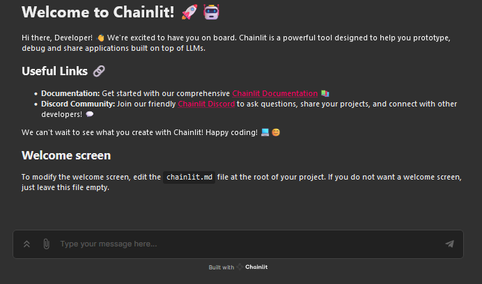

<!---WARNING!! The snippet above is required for Huggingface Space in https://huggingface.co/spaces/SimulaMet-HOST/SoccerRAG, so don't remove or move this.
You need to manually update games.db in space in ./data as space doesn't allow pushing file more than 10MB.
Sushant usually force updates that space repo with Github's version and then uploads the db file manually at https://huggingface.co/spaces/SimulaMet-HOST/SoccerRAG/tree/main/data
--->

# SoccerRAG: Multimodal Soccer Information Retrieval via Natural Queries

## Abstract
The rapid evolution of digital sports media necessitates sophisticated information retrieval systems that can efficiently parse extensive multimodal datasets. This work introduces SoccerRAG, an innovative framework designed to harness the power of Retrieval Augmented Generation (RAG) and Large Language Models (LLMs) to extract soccer-related information through natural language queries. By leveraging a multimodal dataset, SoccerRAG supports dynamic querying and automatic data validation, enhancing user interaction and accessibility to sports archives. Our evaluations indicate that SoccerRAG effectively handles complex queries, offering significant improvements over traditional retrieval systems in terms of accuracy and user engagement. The results underscore the potential of using RAG and LLMs in sports analytics, paving the way for future advancements in the accessibility and real-time processing of sports data.

## Enviroment setup
The framework requires Python 3.12.
````bash
pip install -r requirements.txt
````
Rename .env_demo to .env and fill in the required fields.

## Setting up the database

By running 
````bash
python setup.py
````
from project root, all files will be downloaded, and the database will be set up.
Before running the setup, make sure to fill in the required fields in the .env file, and do a 
````bash
pip install soccernet
````
as this package is not in the requirements.txt file.
Expected setup time is around 10 minutes.

If you want to download the data and set up the database manually, you can do so by following the instructions below.

### Downloading the data manually

The data required to run the code is not included in this repository. 
The data can be downloaded from the [Soccernet](https://www.soccer-net.org/data).
Files needed are:
* Labels-v2.json [link](https://www.soccer-net.org/data#h.5klq86rmgt96)
* Labels-captions.json [link](https://www.soccer-net.org/data#h.ccybjenq8od4)

One can use the soccernet package to download the data:
````bash
pip install soccernet
````

````python
from SoccerNet.Downloader import SoccerNetDownloader
mySoccerNetDownloader = SoccerNetDownloader(LocalDirectory="data/dataset/SoccerNet")
mySoccerNetDownloader.downloadGames(files=["Labels-caption.json"], split=["train", "valid", "test"]) 
mySoccerNetDownloader.downloadGames(files=["Labels-v2.json"], split=["train", "valid", "test"]) 
````

The data should be placed in the ./data/Dataset/SoccerNet/ directory
For each league, create a new folder with the name of the leauge
For each season create a new folder with the name of the season (YYYY-YYYY)
For each game create a new folder with the name of the game (YYYY-MM-DD - HomeTeam Score - Score AwayTeam)
In each game folder, place the Labels-v2.json and Labels-captions.json files

For a full guide on how to download the data, please refer to the [SoccerNet package website](https://pypi.org/project/SoccerNet/).


### Setting up and populating the database
To set up the database, execute the following command:
````bash
python src/database.py
````
Adjust the path to the data in the database.py file as needed.

## Running the code in command line
To run the code, execute the following command:
````bash
The code will prompt you to enter a natural language query.

python main.py
````
You can also call main_cli.py with a query as an argument:
````bash
python main_cli.py -q "How many goals has Messi scored each season?"
````

## Running the code in ChainLit (GUI)
To run the code in ChainLit, execute the following command:
````bash
chainlit run app.py
````
This will open up a browser window with the GUI. 


### Example query
````angular2html
Enter a query: How many goals has Messi scored each season?
Lionel Messi has scored the following number of goals each season:
- 2014-2015: 13 goals
- 2015-2016: 3 goals
- 2016-2017: 31 goals
````


## Results

Sample questions (Q1-Q20) and corresponding results can be found below.

- **Question 1:** Is Manchester United in the database?
- **Question 2:** Give me the total home goals for Bayern M in the 2014-15 season.
- **Question 3:** Calculate home advantage for Real Madrid in the 2015-16 season
- **Question 4:** How many goals did Messi score in the 15-16 season?
- **Question 5:** How many yellow-cards did Enzo Perez get in the 15-2016 season?
- **Question 6:** List all teams that played a game against Napoli in 2016-17 season in seriea? Do not limit the number of results
- **Question 7:** Give all the teams in the league ucl in the 2015-2016 season?
- **Question 8:** Give me all games in epl with yellow cards in the first half in the 2015-2016 season
- **Question 9:** What teams and leagues has Adnan Januzaj play in?
- **Question 10:** List ALL players that started a game for Las Palmas in the 2016-2017 season? Do NOT limit the number of results .
- **Question 11:** Did Ajax or Manchester United win the most games in the 2014-15 season?
- **Question 12:** How many yellow and red cards were given in the UEFA Champions League in the 2015-2016 season?
- **Question 13:** Are Messi and C. Ronaldo in the database?
- **Question 14:** How many goals did E. Hazard score in the game between Bournemouth and Chelsea in the 2015-2016 season?
- **Question 15:** How many yellow cards were given in the game between Bayern Munich and Shakhtar Donetsk in the 2014-15 UEFA Champions League, and did anyone receive a red card?
- **Question 16:** Make a list of when corners happened in the English Premier League (EPL) 2015-2016 season. Aggregate by a period of 15 minutes.
- **Question 17:** What league is Manchester United, Arsenal, Bournemouth, Real Madrid, Chelsea, and Liverpool in?
- **Question 18:** How many players have "Aleksandar" as their first name in the database, and how many goals have they scored in total?
- **Question 19:** What did the commentary say about the game between Arsenal and Southampton in the 2016-17 season?
- **Question 20:** Have Mesut Ozil, Pablo Insua, or Alex Pike played for West Ham or Barcelona?
        


## Acknowledgements
This research was partly funded by the Research Council of Norway, project number 346671 ([AI-Storyteller](https://prosjektbanken.forskningsradet.no/project/FORISS/346671)). 

## Citation
```
@incollection{Strand2024,
    author = {Aleksander Theo Strand and Sushant Gautam and Cise Midoglu and Pål Halvorsen},
    title = {{SoccerRAG: Multimodal Soccer Information Retrieval via Natural Queries}},
    journal = {{CBMI 2024: 21st International Conference on Content-Based Multimedia Indexing}},
    note = {Under review},
    year = {2024},
    publisher = {IEEE}
}
```
